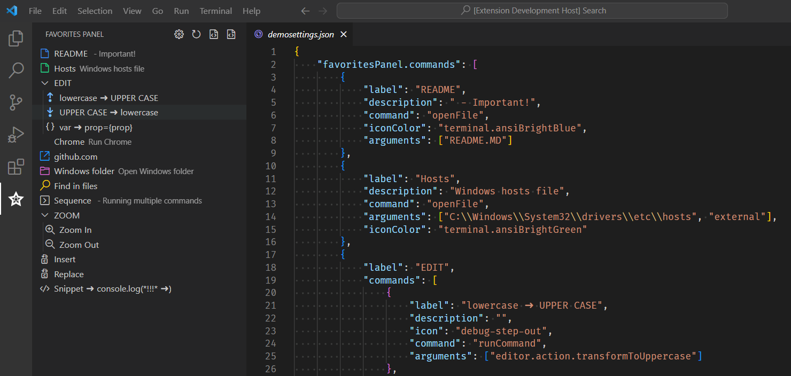
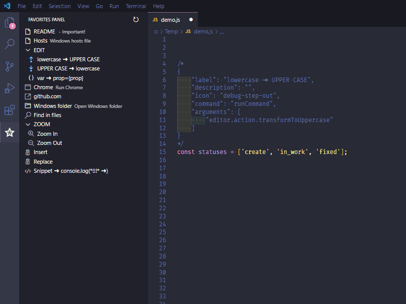

# Favorites Panel

Adds a panel for accessing frequently used files, Internet addresses, programs, commands, snippets.



## Features

- Quick access to your favorite files
- Quick access to favorite URLs
- Fast launch of applications
- Quick access to your favorite files
- Quick access to favorite commands
- Setting icons for commands


## Extension Settings

The extension requires initial configuration.
Edit the settings file VSCODE.
If extension settings are not specified, demo settings will be used.

The extension settings are in section **"favoritesPanel.commands": []** in the settings.json

```json
"favoritesPanel.commands": [
    {
        "label": "README",
        "description": "- read me",
        "icon": "zap",
        "command": "openFile",
        "arguments": ["README.MD"]
    }
]
```
List of available [icons](https://code.visualstudio.com/api/references/icons-in-labels#icon-listing "icons")

## Examples of using the plugin

### Editing code
```json
{
    "label": "lowercase ➜ UPPER CASE",
    "description": "",
    "icon": "debug-step-out",
    "command": "runCommand",
    "arguments": [
        "editor.action.transformToUppercase"
    ]
}
```



### Opening file

#### File in project

Settings for opening file in project

```json
{
    "label": "README",
    "description": "- read me",
    "command": "openFile",
    "arguments": ["README.MD"]
}
```
#### File is out project 

Settings for opening file in project

```json
    {
      "label": "Hosts",
      "description": "Windows hosts file",
      "command": "openFile",
      "arguments": ["C:\\Windows\\System32\\drivers\\etc\\hosts", "external"]
    }
```
### Run program

Settings for run program

#### Run Chrome in OS Windows

```json
    {
      "label": "Chrome",
      "description": "Run Chrome",
      "command": "run",
      "arguments": ["start chrome"]
    }
```
#### Open folder in OS Windows

```json
    {
      "label": "Windows",
      "description": "",
      "command": "run",
      "arguments": ["start explorer /n, C:\\Windows"]
    }
```

### Open URL

Settings for open URL

```json
    {
      "label": "github.com",
      "description": "",
      "command": "runCommand",
      "arguments": ["vscode.open", "https://github.com"],
    }
```
### Run Command

Settings for running arbitrary commands

```json
{
  "label": "Zoom In",
  "description": "",
  "command": "runCommand",
  "arguments": ["editor.action.fontZoomIn"],
}
```
#### Open Search panel
command: workbench.action.findInFiles
arguments:
- query?: string;
-	isRegex?: boolean;
-	triggerSearch?: boolean;
-	filesToInclude?: string;
-	filesToExclude?: string;
-	isCaseSensitive?: boolean;

```json
{
  "label": "Find in files",
  "description": "",
  "command": "runCommand",
  "arguments": ["workbench.action.findInFiles", {"query": "SearchPattern", "triggerSearch": true}],
},
```

#### Insert text
Search and insert text by regexp pattern. Searches until the first match.

```json
{
  "label": "Replace",
  "description": "",
  "icon": "find-replace",
  "command": "insertNewCode",
  "arguments": ["ui/components/tableItem.ts", "<td className=\"col-date-time\">", "<div className=\"new\">NewText</div>", "before"],
}
```

#### Replace text
Search and replace text by regexp pattern. Searches until the first match.

```json
{
  "label": "Replace",
  "description": "",
  "icon": "find-replace",
  "command": "insertNewCode",
  "arguments": ["ui/components/tableItem.ts", "<td className=\"col-date-time\">", "<div className=\"WOW\"></div>", "replace"]
}
```

#### Replace All text
Search and replace text by regexp pattern. Searches all match.

```json
{
  "label": "ReplaceAll",
  "description": "",
  "icon": "find-replace",
  "command": "insertNewCode",
  "arguments": ["ui/components/tableItem.ts", "<td className=\"col-date-time\">", "<div className=\"WOW\"></div>", "replaceALL"]
}
```

### Settings for example:

Copy this snippet of settings into settings.json file (VS Code settings file) to see the extension in action.

```json
    "favoritesPanel.commands": [
        {
            "label": "README",
            "description": " - Important!",
            "command": "openFile",
            "arguments": ["README.MD"]
        },
        {
            "label": "Hosts",
            "description": "Windows hosts file",
            "command": "openFile",
            "arguments": ["C:\\Windows\\System32\\drivers\\etc\\hosts", "external"]
        },
        {
            "label": "EDIT",
            "commands": [
                {
                    "label": "lowercase ➜ UPPER CASE",
                    "description": "",
                    "icon": "debug-step-out",
                    "command": "runCommand",
                    "arguments": [
                        "editor.action.transformToUppercase"
                    ]
                },
                {
                    "label": "UPPER CASE ➜ lowercase",
                    "description": "",
                    "icon": "debug-step-into",
                    "command": "runCommand",
                    "arguments": [
                        "editor.action.transformToLowercase"
                    ]
                },
                {
                    "label": "var ➜ prop={prop}",
                    "description": "",
                    "icon": "symbol-namespace",
                    "command": "runCommand",
                    "arguments": [
                        "editor.action.insertSnippet",
                        {
                            "snippet": "$TM_SELECTED_TEXT={$TM_SELECTED_TEXT}"
                        }
                    ]
                }
            ]
        },
        {
            "label": "Chrome",
            "description": "Run Chrome",
            "icon": "browser",
            "command": "run",
            "arguments": ["start chrome"]
        },
        {
            "label": "github.com",
            "description": "",
            "icon": "link-external",
            "command": "runCommand",
            "arguments": ["vscode.open", "https://github.com"]
        },
        {
            "label": "Windows folder",
            "description": "Open Windows folder",
            "icon": "symbol-folder",
            "command": "run",
            "arguments": ["start explorer /n, C:\\Windows"]
        },
        {
            "label": "Find in files",
            "description": "",
            "icon": "search",
            "command": "runCommand",
            "arguments": ["workbench.action.findInFiles", {"query": "SearchPannern", "triggerSearch": true}]
        },
        {
            "label": "ZOOM",
            "commands": [
                {
                    "label": "Zoom In",
                    "description": "",
                    "icon": "zoom-in",
                    "command": "runCommand",
                    "arguments": ["editor.action.fontZoomIn"]
                },
                {
                    "label": "Zoom Out",
                    "description": "",
                    "icon": "zoom-out",
                    "command": "runCommand",
                    "arguments": ["editor.action.fontZoomOut"]
                }
            ]
        },
        {
            "label": "Insert",
            "description": "",
            "icon": "find-replace",
            "command": "insertNewCode",
            "arguments": ["ui/components/tableItem.ts", "<td className=\"col-date-time\">", "<div className=\"WOW\"></div>", "before"]
        },
        {
            "label": "Replace",
            "description": "",
            "icon": "find-replace",
            "command": "insertNewCode",
            "arguments": ["package.json", "\"webpack\": \"node --max-old-space-size=4096", "\"webpack\": \"node --max-old-space-size=8192", "replace"]
        },
        {
            "label": "Snippet ➜ console.log(*!!!* ➜)",
            "description": "",
            "icon": "code",
            "command": "runCommand",
            "arguments": [
                "editor.action.insertSnippet",
                {
                    "snippet": "console.log('***** !!! ***** ${1| ,this.props,this.state,props|} ----->', $1);"
                }
            ]
        }
    ]
```


## Release Notes

### 0.10.0 | 2021/02/05

- Added the _replaceAll_ parameter of the __favoritesPanel.insertNewCode__ command.

More information in the [changelog](CHANGELOG.md "Changelog")
