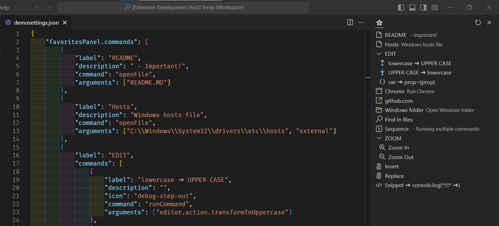
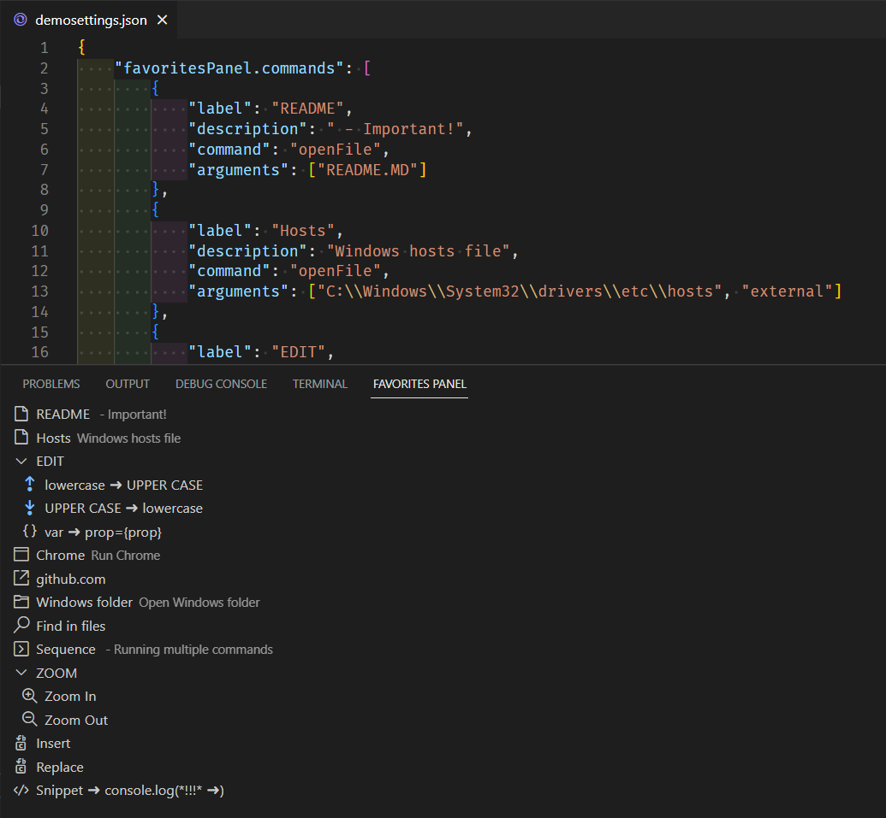

[](https://marketplace.visualstudio.com/items?itemName=sabitovvt.favorites-panel) [](https://marketplace.visualstudio.com/items?itemName=sabitovvt.favorites-panel) [](https://marketplace.visualstudio.com/items?itemName=sabitovvt.favorites-panel) [](https://open-vsx.org/extension/sabitovvt/favorites-panel) [](https://github.com/sabitovvt/vscode-favorites-panel) [](https://github.com/sabitovvt/vscode-favorites-panel)

# Favorites Panel

The extension adds a panel for accessing frequently used commands, files, directories, URLs, programs, snippets. The panel can be standalone or as part of the Explorer (In this case, you can drag the panel like any other to the desired location).


## Features

- Quick access to favorite commands
- Running multiple commands in sequence
- Quick access to your favorite files and folders
- Quick access to favorite URLs
- Fast launch of applications
- Setting icons for commands
- Separation setting for different workspaces


## Extension Settings

The extension requires initial configuration.  
Edit the settings file VSCODE.  
If extension settings are not specified, demo settings will be used.

The extension settings are in section **"favoritesPanel.commands": []** in the Settings(settings.json).
You can also place settings in custom files **favoritesPanel.configPath**.

If you want to make specific settings for each workspace, then use **favoritesPanel.commandsForWorkspace** or
 **favoritesPanel.configPathForWorkspace**. in the workspace settings.

The order of loading and displaying the settings:
- **Settings: favoritesPanel.commands**
- **Settings: favoritesPanel.commandsForWorkspace**
- **Settings: favoritesPanel.configPath: "full_path_to_custom_configuration_file"**
- **Settings: favoritesPanel.configPathForWorkspace: "full_path_to_custom_configuration_file"**
- **.vscode/favoritesPanel.json** in project folder
- **.favoritesPanel.json** in project folder
- **favoritesPanel.json** in project folder

### favoritesPanel.commands
```json
"favoritesPanel.commands": [
    {
        "label": "README",
        "description": "- read me",
        "icon": "zap",
        "command": "openFile",
        "arguments": ["README.MD"]
    }
]
```

### favoritesPanel.commandsForWorkspace
Use this setting if you wish to set specific settings for the workspace.
>Please note that you need to specify this setting in the workspace setting, not the User settings
```json
"favoritesPanel.commandsForWorkspace": [
    {
        "label": "README",
        "description": "- read me",
        "icon": "zap",
        "command": "openFile",
        "arguments": ["README.MD"]
    }
]
```

### favoritesPanel.configPath
example for OS Windows
```json
"favoritesPanel.configPath": "C:\\Projects\\favoritesPanel.json"
```

### favoritesPanel.configPathForWorkspace
Use this setting if you wish to set specific settings for the workspace.
>Please note that you need to specify this setting in the workspace setting, not the User settings

Example for OS Windows
```json
"favoritesPanel.configPathForWorkspace": "C:\\Projects\\favoritesPanelForMyProject.json"
```

### favoritesPanel.explorerView
Moves the "Favorites Panel" in the explorer view. This allows you to drag the panel to a different location. Examples are shown in the screenshots.
```json
"favoritesPanel.explorerView": true
```

Secondary Side Bar | Bottom Panel
:-------------------------:|:-------------------------:
 | 

## Displayed command settings
You must set the required parameter __label__.
You can specify __description__, __icon__
Find the icon you need [here](https://code.visualstudio.com/api/references/icons-in-labels#icon-listing "icons").

## Examples of using the plugin

### Editing code
```json
{
    "label": "lowercase ➜ UPPER CASE",
    "description": "",
    "icon": "debug-step-out",
    "command": "runCommand",
    "arguments": [
        "editor.action.transformToUppercase"
    ]
}
```


### Opening file

#### File in project

settings for opening file in project

```json
{
    "label": "README",
    "description": "- read me",
    "command": "openFile",
    "arguments": ["README.MD"]
}
```
#### File is out project 

settings for opening file in project

```json
    {
      "label": "Hosts",
      "description": "Windows hosts file",
      "command": "openFile",
      "arguments": ["C:\\Windows\\System32\\drivers\\etc\\hosts", "external"]
    }
```
### Run program

settings for run program

#### Run Chrome in OS Windows

```json
    {
      "label": "Chrome",
      "description": "Run Chrome",
      "command": "run",
      "arguments": ["start chrome"]
    }
```
#### Open folder in OS Windows

```json
    {
      "label": "Windows",
      "description": "",
      "command": "run",
      "arguments": ["start explorer /n, C:\\Windows"]
    }
```

### Open URL

settings for open URL

```json
    {
      "label": "github.com",
      "description": "",
      "command": "runCommand",
      "arguments": ["vscode.open", "https://github.com"],
    }
```
### Run Command

settings for running arbitrary commands

```json
{
  "label": "Zoom In",
  "description": "",
  "command": "runCommand",
  "arguments": ["editor.action.fontZoomIn"],
}
```
#### Open Search panel
command: `workbench.action.findInFiles`
arguments:
- `query?: string;`
- `isRegex?: boolean;`
- `triggerSearch?: boolean;`
- `filesToInclude?: string;`
- `filesToExclude?: string;`
- `isCaseSensitive?: boolean;`

```json
{
  "label": "Find in files",
  "description": "",
  "command": "runCommand",
  "arguments": ["workbench.action.findInFiles", {"query": "SearchPattern", "triggerSearch": true}],
},
```

#### Insert text
Search and insert text by regexp pattern. Searches until the first match.

```json
{
  "label": "Replace",
  "description": "",
  "icon": "find-replace",
  "command": "insertNewCode",
  "arguments": ["ui/components/tableItem.ts", "<td className=\"col-date-time\">", "<div className=\"new\">NewText</div>", "before"],
}
```

#### Replace text
Search and replace text by regexp pattern. Searches until the first match.

```json
{
  "label": "Replace",
  "description": "",
  "icon": "find-replace",
  "command": "insertNewCode",
  "arguments": ["ui/components/tableItem.ts", "<td className=\"col-date-time\">", "<div className=\"WOW\"></div>", "replace"]
}
```

#### Replace All text
Search and replace text by regexp pattern. Searches all match.

```json
{
  "label": "ReplaceAll",
  "description": "",
  "icon": "find-replace",
  "command": "insertNewCode",
  "arguments": ["ui/components/tableItem.ts", "<td className=\"col-date-time\">", "<div className=\"WOW\"></div>", "replaceALL"]
}
```

### Sequence
running multiple commands
>Doesn't work if it's in the commands array

```json
{
    "label": "Sequence",
    "description": " - Running multiple commands",
    "icon": "console",
    "sequence": [
        {
            "command": "runCommand",
            "arguments": ["workbench.action.terminal.new"]
        },
        {
            "command": "runCommand",
            "arguments": ["workbench.action.terminal.focus"]
        },
        {
            "command": "runCommand",
            "arguments": [
                "workbench.action.terminal.renameWithArg",
                {
                    "name": "New Terminal"
                }
            ]
        },
        {
            "command": "runCommand",
            "arguments": [
                "workbench.action.terminal.sendSequence",
                {
                    "text": "node -v\nnpm -v\ngit --version\n"
                }
            ]
        }
    ]
}
```

### Settings for example:

Copy this snippet of settings into settings.json file (VS Code settings file) to see the extension in action.

```json
"favoritesPanel.commands": [
    {
        "label": "README",
        "description": " - Important!",
        "command": "openFile",
        "arguments": ["README.MD"]
    },
    {
        "label": "Hosts",
        "description": "Windows hosts file",
        "command": "openFile",
        "arguments": ["C:\\Windows\\System32\\drivers\\etc\\hosts", "external"]
    },
    {
        "label": "EDIT",
        "commands": [
            {
                "label": "lowercase ➜ UPPER CASE",
                "description": "",
                "icon": "debug-step-out",
                "command": "runCommand",
                "arguments": ["editor.action.transformToUppercase"]
            },
            {
                "label": "UPPER CASE ➜ lowercase",
                "description": "",
                "icon": "debug-step-into",
                "command": "runCommand",
                "arguments": ["editor.action.transformToLowercase"]
            },
            {
                "label": "var ➜ prop={prop}",
                "description": "",
                "icon": "symbol-namespace",
                "command": "runCommand",
                "arguments": [
                    "editor.action.insertSnippet",
                    {
                        "snippet": "$TM_SELECTED_TEXT={$TM_SELECTED_TEXT}"
                    }
                ]
            }
        ]
    },
    {
        "label": "Chrome",
        "description": "Run Chrome",
        "icon": "browser",
        "command": "run",
        "arguments": ["start chrome"]
    },
    {
        "label": "github.com",
        "description": "",
        "icon": "link-external",
        "command": "runCommand",
        "arguments": ["vscode.open", "https://github.com"]
    },
    {
        "label": "Windows folder",
        "description": "Open Windows folder",
        "icon": "symbol-folder",
        "command": "run",
        "arguments": ["start explorer /n, C:\\Windows"]
    },
    {
        "label": "Find in files",
        "description": "",
        "icon": "search",
        "command": "runCommand",
        "arguments": ["workbench.action.findInFiles", {"query": "SearchPannern", "triggerSearch": true}]
    },
    {
        "label": "Sequence",
        "description": " - Running multiple commands",
        "icon": "console",
        "sequence": [
            {
                "command": "runCommand",
                "arguments": ["workbench.action.terminal.new"]
            },
            {
                "command": "runCommand",
                "arguments": ["workbench.action.terminal.focus"]
            },
            {
                "command": "runCommand",
                "arguments": [
                    "workbench.action.terminal.renameWithArg",
                    {
                        "name": "New Terminal"
                    }
                ]
            },
            {
                "command": "runCommand",
                "arguments": [
                    "workbench.action.terminal.sendSequence",
                    {
                        "text": "node -v\nnpm -v\ngit --version\n"
                    }
                ]
            }
        ]
    },
    {
        "label": "ZOOM",
        "commands": [
            {
                "label": "Zoom In",
                "description": "",
                "icon": "zoom-in",
                "command": "runCommand",
                "arguments": ["editor.action.fontZoomIn"]
            },
            {
                "label": "Zoom Out",
                "description": "",
                "icon": "zoom-out",
                "command": "runCommand",
                "arguments": ["editor.action.fontZoomOut"]
            }
        ]
    },
    {
        "label": "Insert",
        "description": "",
        "icon": "find-replace",
        "command": "insertNewCode",
        "arguments": ["ui/components/tableItem.ts", "<td className=\"col-date-time\">", "<div className=\"WOW\"></div>", "before"]
    },
    {
        "label": "Replace",
        "description": "",
        "icon": "find-replace",
        "command": "insertNewCode",
        "arguments": [
            "package.json",
            "\"webpack\": \"node --max-old-space-size=4096",
            "\"webpack\": \"node --max-old-space-size=8192",
            "replace"
        ]
    },
    {
        "label": "Snippet ➜ console.log(*!!!* ➜)",
        "description": "",
        "icon": "code",
        "command": "runCommand",
        "arguments": [
            "editor.action.insertSnippet",
            {
                "snippet": "console.log('***** !!! ***** ${1| ,this.props,this.state,props|} ----->', $1);"
            }
        ]
    }
]
```


## Release Notes

### 1.2.0 | 2023/03/25
- Added setting __favoritesPanel.commandsForWorkspace__.
- Added setting __favoritesPanel.configPathForWorkspace__.
- Added the ability to open settings from panel menu.

More information in the [changelog](CHANGELOG.md "Changelog").
